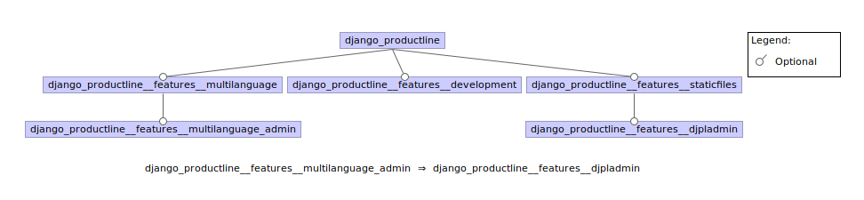

################################
django-productline feature model
################################

The following shows the feature model of ``django-productline``.
This was created using the Eclipse plugin FeatureIDE.

You can install it from here:

http://wwwiti.cs.uni-magdeburg.de/iti_db/research/featureide/

Or you can use the Eclipse marketplace.

********************************
django-productline feature model
********************************

You can download the model from here: :download:`model.xml <../model.xml>`
